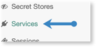
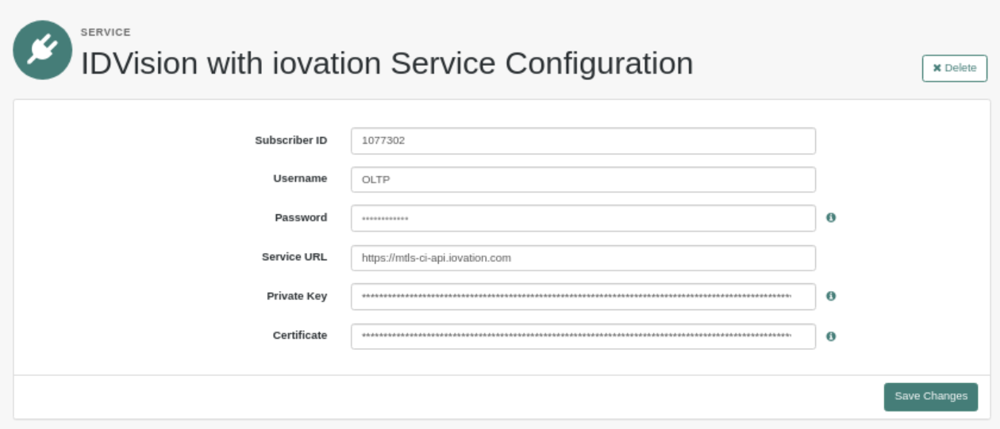
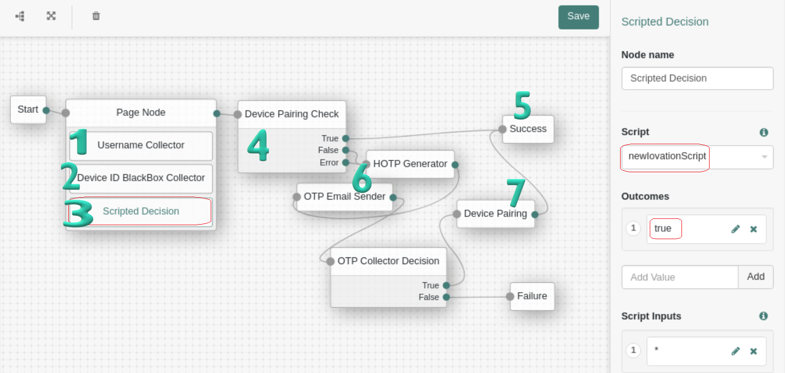
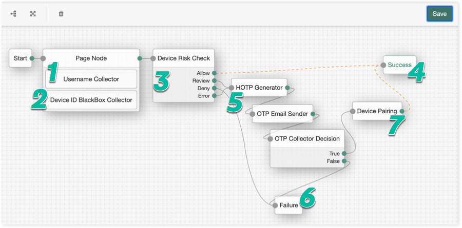

# IDVision with iovation Risk-Based Authentication Plugin for ForgeRock Quick Start

## Overview

The IDVision with iovation Risk-Based Authentication Plugin for ForgeRock 
enables you to integrate transparent device-based authentication directly into 
your login flows. The Plugin adds the following to your ForgeRock authentication
workflows:

  - Create a blackbox, an encrypted string that contains device attributes and is the basis of
    iovation device recognition and a unique device ID
  - Check whether a device is registered to a customer's account using
    IDVision device-based authentication. 
  - Perform a full risk check against the device using IDVision with iovation
    device-based reputation. If you are unfamiliar with a device and want greater
    reassurance that you can trust it, IDVision can check for fraud
    history in our global device network, and determine whether the
    device has behaved suspiciously at any sites where it is already
    known.
  - Register trusted devices with customers' accounts using IDVision with iovation
    device-based authentication. The next time your customer visits, accelerate their login
    by verifying that they are using known, trusted devices.

## What You Need to Get Started

### Components

To implement the Plugin for ForgeRock, you need:

  - A website that uses ForgeRock Access Management to provide user
    access management and authentication.
  - Established iovation implementations that include the following:
      - Device-based authentication, in order to register your customers' devices
        with their accounts and use them as authentication factors.
      - Optionally, device-based reputation, in order to check a transaction
        for risk signals. You must set up an integration point and
        business rules for the transaction.
  - The plugin, which is available from GitHub:
    <https://github.com/iovation/risk-based-authentication-forgerock-plugin/releases>

### New to IDVision with iovation?

Learn more about IDVision with iovation device-based authentication and reputation
here:
[https://www.iovation.com](https://www.iovation.com "https://www.iovation.com")

Ready to schedule a demo? Reach out to us here:
<https://www.iovation.com/demo?>

## How the Plugin Works

Let's look at how the plugin integrates into ForgeRock, and the data
flows when a customer logs in. This workflow describes a scenario that
includes both device-based authentication and reputation; depending on your 
license, you can implement either or both of these.

1.  First confirm that the user has an established account, for example
    by verifying a password.
2.  Then, use device-based authentication to determine whether the device is
    registered to a customer's account:
    1.  When a customer logs in to a site that provides user access
        management and authentication with ForgeRock, ForgeRock sends an
        API request to IDVision to check whether the current device is
        known for the customer. This calls a dedicated registration
        check API.
    2.  Via the API, IDVision returns an assessment to ForgeRock of how
        closely the device matches any that are already known for the
        customer. If the device is known, you may continue to log the
        customer in by mapping the iovation results to the next steps in
        the workflow.
3.  If the device is unknown, you may opt to implement a full risk-aware
    authentication step by performing a transaction risk check with
    iovation FraudForce. You can then use the result to help decide next
    steps:
    1.  Perform a full device risk assessment with IDVision device-based 
        reputation. ForgeRock sends an API request to iovation to evaluate 
        device and transaction attributes for risk signals based on business
        rules that you have set up for the integration point.  
        **NOTE**
        All device details and business rule results are stored with IDVIsion
        with iovation; as with any other integration point, you can review 
        transaction details in the iovation Intelligence Center.
    2.  IDVision returns the transaction outcome to ForgeRock. Within
        your ForgeRock workflow, you may choose to allow users in with
        **Allow** results, block users with **Deny** results, or require additional 
        authentication steps for users with **Review** results. For example, 
        you might use IDVIsion with iovation Multifactor Authentication 
        to implement mobile multifactor authentication.

## Installing the Plugin

The plugin runs on your ForgeRock Access Management server. You must
install it before you can implement it.

1.  Go to the ForgeRock MarketPlace:
    <https://backstage.forgerock.com/marketplace/catalogDisplay>
2.  Search for iovation. From here you can download the plugin, which
    resides on Github:
    [https://github.com/iovation](https://github.com/iovation "https://github.com/iovation")
3.  Unzip the download.
4.  Copy **iovation-rba-forgerock-plugin-1.0.2.jar** to the following location 
    on your ForgeRock AM server: 
    `<root>/webapps/openam/WEB-INF/lib`

## Preparing to Set Up the Plugin

### What's Included?

Once you've added it to an authentication tree, IDVision with iovation
Risk-Based Authentication provides the following nodes:

  - **Device ID BlackBox Collector:** This node resides on your page and
    will collect a device print, or blackbox, that includes all of the
    device details that IDVision with iovation needs to assess whether the 
    device is known and if it suggests potential for risky behavior.
  - **Device Pairing Check:** This nodeVerifies whether the device is
    already known and associated with the customer's account, and which
    enables you to map followup actions based on the result.
  - **Device Pairing:** Once you are confident that a new device
    is legitimate and belongs to a good customer, this node registers 
    the device to a customer's account.
  - **Device Pairing Reset:** Resets all device registrations for
    a user's account.
  - **Device Risk Check:** Assesses fraud risk for a device,
    providing additional awareness and assurance of a device before you
    allow it to log in and register with an account.

### What Information Will You Need?

You'll need the following information about your iovation
implementation:

  - Your iovation subscriber ID
  - Your iovation subscriber account name and password
  - If you will use the Risk Check node, the name of the rule set
    that you will send transactions to
  - URLs to the iovation services. Set this to one of the following:
      - Customer Integration (CI) environment as you are testing integration: `https://mtls-ci-api.iovation.com/`
      - Production, when you are ready to take your integration live: `https://mtls.api.iovation.com`

## Adding the Risk-Based Authentication Plugin to Your ForgeRock Realm

In order to add IDVision with iovation to your ForgeRock Authentication tree,
you must add a service configuration to your realm.

To add the IDVision with iovation service to your realm:

1. From the Forgerock Admin homepage, select your realm.

2.  Select **Services** from the left-hand navigation bar. 
    
3.  Click **Add a Service**.
4.  When prompted to choose a service type, select **IDVision with iovation Service
    Configuration** and then select **Create**.
    
5.  In the **SERVICE** screen that appears, enter the following:
    1. Your iovation subscriber ID
    2. Your iovation account name and password
    3. The root iovation API URL. Set this to one of the following:
         - Customer Integration (CI) environment as you are testing integration: `https://mtls-ci-api.iovation.com/`
         - Production, when you are ready to take your integration live: `https://mtls.api.iovation.com`
      4. Your private key and certificate. These two fields are mandatory if you give mtls service URL.
      5. Click **Save Changes**.

## Setting Up Your Authentication Tree

### Adding Device-Based Authentication Nodes

#### Example Authentication Tree Configuration

Let's look at an example authentication tree with integrated IDVision with iovation Device-Based Authentication nodes. Follow this sequence to add ClearKey to your own login page.

| Step | Description |
|------|-------------|
|***1***| Include a _Username Collector_ to gather the username from the customer; IDVision with iovation will then use this to locate the corresponding account ID. |
|***2***|Add the _Device ID BlackBox Collector_ node to your page in order to collect information on the user's device. The *Device ID BlackBox Collector* automatically integrates with iovation web device print services, creating a blackbox that you can then send to iovation device registration. No configuration is required. This is required before using device pairing features.  This example includes a choice to enable users to forget previous device registrations. This calls the *Device Pairing Reset* node and returns the user to the login page. For your own flows, you can choose whether to expose this to end-users. You can also reset pairings from the Intelligence Center and a standalone API which is fully documented in the iovation Help Center.|
|***3***|Include _Scripted Decision_ node that calls server-side JavaScript to set the outcome for the node programmatically and determine the path the authentication journey takes. The script can perform actions before setting the outcome.|
|***4***|Confirm that the user has an established account, for example by verifying password.  Once you've verified the account, use the _Device Pairing Check_ node to determine whether the customer's device is already registered to the user's account. This sends the blackbox to iovation, which returns a **True** or **False** result.|
|***5***|If the device is known, allow the user to log in.|
|***6***|If not, we send the device through a step-up flow for additional verification. In this example, we use a one-time-password (OTP) sent through email, however you can customize the process as needed. For example, use IDVision with iovation Device-Based Reputation to perform a risk check on the device, or route through other flows that trigger multifactor solutions such as iovation Multifactor Authentication.|
|***7***|In this example, if the user passes the OTP step, the device is registered with iovation via the *Device Pairing* node before completing the login flow.|

#### 1. Configuring the Device ID Blackbox Collector Node

The *Device ID Blackbox Collector* node creates a profile of the user's device 
and stores it as an encrypted string called a blackbox. It is required.

1.  Include the *Username Collector node* on your login page. This will
    populate the customer's username, which will be passed to IDVision with 
    iovation as the account ID. By always basing the account ID on this username,
    it will always be consistent when checking registered devices, registering new 
    devices, resetting registrations, and when running risk checks.
2.  Add the *Device ID BlackBox Collector* node to your page. It
    creates the blackbox, which populates the context for the 
    *Device Pairing Check* node. Optionally update the node name. 
3.  In the **WDP Third Party Host** field, verify that the URL to the iovation device print 
    server is correct. By default, this is: ` https://mpsnare.iesnare.com/`  
4.  Optionally modify your subscriber key, which your iovation Integration Engineer 
    can provide to you.

#### 2. Configuring the Scipted Decision Node
Need to add a JavaScript through Scripted Decision node. Here we will see how to add it.

**Steps to add Scripted Decision Node**
1.  Go to Scripts page and click New Script button.
2. 	Give name of the script and select the script type as “Decision node script for authentication trees” and click Create button.
3.  Copy the JavaScript from  and paste it into script box and click save changes.
4.  Add scripted decision node in your journey inside the Page node. Click the Scripted Decision node and select your newly created script and save your changes.

#### 3. Configuring the Device Pairing Check Node

The *Device Pairing Check* node determines whether the device is
registered. It is required.

**IMPORTANT!** The *Device Pairing Check* node uses the iovation Registration Check API 
which is only supported as part of the ForgeRock plugin. To check pairing status via 
direct integrations on your web pages or in your apps, use the transaction risk 
check API together with the *Registered / Account Device Pair* business rule.

Add the *Device Pairing Check* node to your authentication tree. Optionally set a custom 
node name.

#### 4. Configuring the Device Pairing Node

The *Device Pairing* node registers the device with the customer's iovation account ID. It is required. 
To set it up, add it to your authentication tree. Optionally set a custom node name.

#### 5. Using the Device Pairing Reset Node

The optional *Device Pairing Reset* node resets any existing registrations with a given 
account, effectively forgetting all known devices. To use it, add it wherever necessary 
node to your authentication tree. Optionally set a custom node name.

### Adding the Device Risk Check Node

#### Overview

The *Device Risk Check* node sends the device details and basic transaction data to 
IDVision with iovation for a transaction risk check. It returns
one of the following:

  - **Allow**: An **Allow** result provides risk assurance; you can proceed to 
    allow the user to log in knowing that the device appears trustworthy. 
  - **Review**: A **Review** result suggests that the device appears potentially risky and
    requires more assurance such as multi-factor authentication. 
  - **Deny**: A **Deny** result signifies a high potential for fraud or abuse; you may opt to
    deny entry entirely in this case.

#### Example Authentication Tree Workflow with Integrated Risk Check

Optionally follow this sequence to set up a basic risk check flow.

|Step|Description|
|----|-----------|
|***1***| Include a _Username Collector_ to gather the username from the customer; iovation will then use this to locate the corresponding iovation account ID. |
|***2***| Add the _Device ID BlackBox Collector_ node to your page node in order to collect information on the user's device. This node automatically integrates with iovation web device print services, creating a blackbox that you can then send to IDVision with iovation for fraud checks and device registration. No configuration is needed. |
|***3***| **IMPORTANT!** Before running a risk check, confirm that the user has an established account, for example by verifying password.  Use the _Device Risk Check_ node to determine if the device is risky based on fraud history, evidence of evasion, and many other factors. This sends the blackbox to iovation, which returns an **Allow**, **Review**, or **Deny** result. |
|***4***| An **Allow** result means that the device appears trustworthy according to your business rules. Complete the login flow and allow the user to enter.|
|***5***| If the result is **Review**, meaning that your rule set identified significant enough risk to warrant manual assessment of the the device and account, send the device through a step-up flow for additional verification. In this example, we use a one-time-password (OTP) sent through email, however you can customize the process as needed. For example, route through other flows that trigger multifactor solutions such as iovation multifactor authentication. |
|***6***| If the *Fraud Check* result is **Deny**, or if the user fails the OTP step, access fails. |
|***7***| In this example, if the user passes the OTP step, the device is registered with iovation via the *Device Pairing* node before completing the login flow. |

#### Configuring the Device Risk Check Node

1.  Include the *Username Collector* node on your login page. This will
    populate the customer's username, which will be passed to iovation
    as the account ID. When you register a device, if the customer's
    account doesn't already exist, iovation will create it using the
    value from the *Username Collector* node. By always basing the
    account ID on this username, it will always be consistent when
    checking registered devices, registering new devices, and when
    running device risk checks.
2.  Include the *Device ID BlackBox Collector* node on your page. It
    creates the blackbox, which captures the device data that iovation
    uses to assess transaction risk.
3.  Add the *Device Risk Check* node to your authentication tree and
    configure the following:
    1.  Optionally set a custom node name.
    2.  Enter the name of the rule set that you have configured for this
        integration point.

# Managing Errors

If errors occur during processing, they will result in error outcomes.

© Copyright 2022 iovation, Inc.
